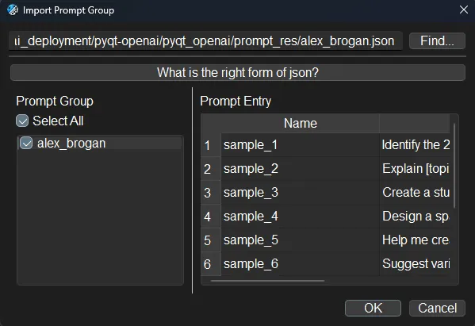

# GPT-pyqt

  <b>A cross-platform AI desktop chatbot application for LLM such as GPT, Claude, Gemini, Llama chatbot interaction and image generation, offering customizable features, local chat history, and enhanced performance—no browser required!  
  Basically for free, powered by GPT4Free(since v1.3.0).</b>

  
  

  
    
    
    

  

## What is GPT-pyqt? 🤔

**GPT-pyqt** is a cross-platform desktop application that allows you to interact directly with LLM(GPT, Claude, Gemini, Llama) chatbots and generate images without needing a browser. Built with PySide6, GPT-pyqt (formerly known as pyqt-openai) supports Windows, Mac, and Linux, and securely stores your chat history locally in a database.

### Key Features:
- **Chat Interface**: Enjoy a seamless chat experience with a customizable interface, fast thread and message search, and advanced conversation settings. You can also import/export chat histories and use prompt management tools for efficient prompt engineering.
- **Image Generation**: Generate images using OpenAI’s DALL-E 3 or models from Replicate, directly within your chat sessions. The app supports multi-image generation, automatic saving, and integrated image management.
- **Focus and Accessibility Modes**: Utilize Focus Mode, “Always on Top” Mode, transparency adjustments, and background notifications to keep the chat accessible and responsive without overwhelming system resources.
- **Customization and Shortcuts**: GPT-pyqt offers extensive customization options, including language settings, memory management, and a comprehensive list of keyboard shortcuts for faster operations.

With GPT-pyqt, you can experience a more powerful and resource-efficient alternative to browser-based GPT interfaces, making it easier to manage both text and image-based interactions.

## Sidenote 🗒️
Although this is named 'pyqt-openai', the model does not use only OpenAI-related models, and the GUI is created using PySide6, not PyQt. 'pyqt-openai' was the package name decided initially, and we are still using it as changing the package name now would likely result in a huge disaster.

## How to Install

### Install with traditional way
1. git clone ~
2. cd pyqt-openai
3. pip install -r requirements.txt --upgrade
4. cd pyqt_openai
5. python main.py

### Install with pyproject.toml 
1. git clone ~
2. Run shell as Administrator
3. cd pyqt-openai
4. pip install .
5. pyqt-openai
